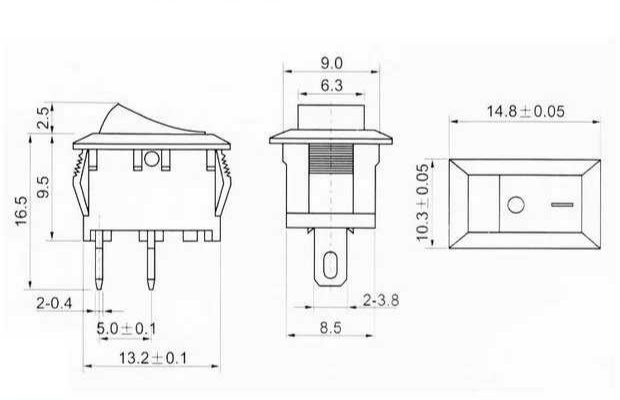
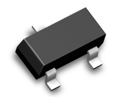
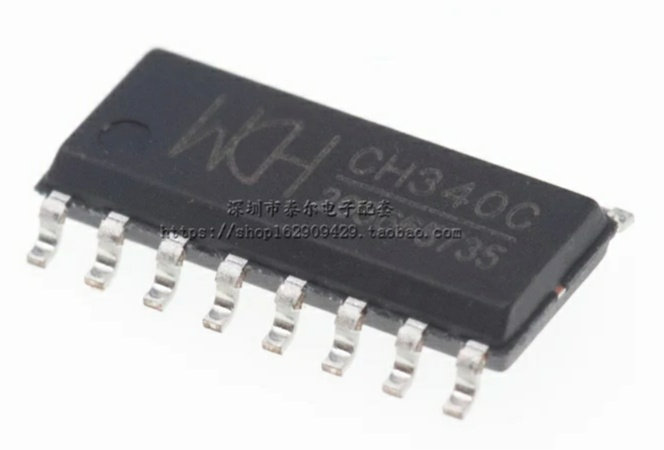
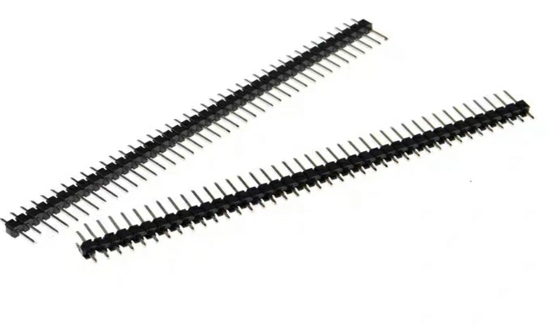
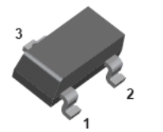
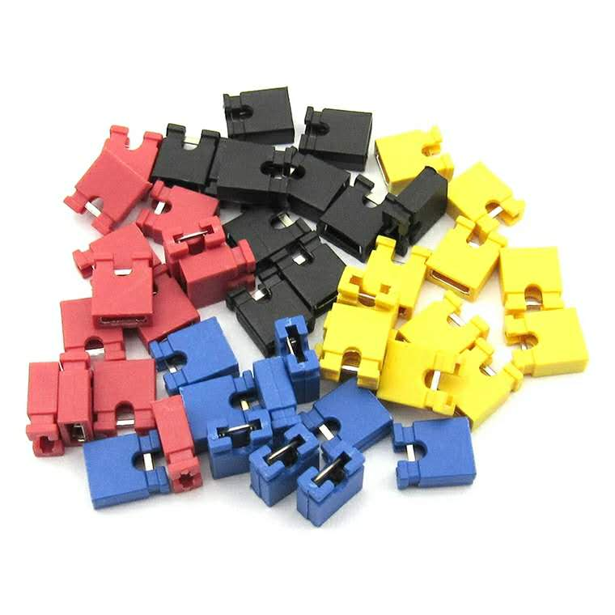

# Altium Designer

# BOM
|LibRef|Designator|Footprint|Description|Quantity|补充说明|参考图片|
|:----|:----|:----|:----|:----|:----|:----|
|117S|117S|117S,两脚|船形开关|1|已购||
|BAT54S|BAT54S|SOT-23|肖特基二极管|1|||
|Cap|C1, C2, C3, C4, C5, C6, C7, C8, C9, C10, C11, C12, C13, C14|SOT-23|贴片电容|14|100p\*2, 10n\*1, 100n\*3, 1u\*2, 10u\*1, 22u\*1, 47u\*3||
|CH340C	|CH340C	|SOP16	|USB2TTL电平转换芯片(免晶振)	|1	|||
|DC005	|DC005	|DC005	|直流电源插座(5.5*2.1母座)	|1	|||
|LM358	|LM358-1, LM358-2	|SOP-8	|集成运放	|2	|||
|LM2596	|LM2596	|LM2596S	|直流降压模块|	1	|||
|microUSB	|microUSB	|MicroUSB-SIP-5	|将microUSB转换成SIP接口	|1	|||
|Mic1	|MK	|DIP2	|咪头	|1	|已购||
|Header 4	|P1	|HDR1X4	|Header, 4-Pin串口引出管脚	|1	|已购||
|S8050	|Q1, Q2	|SOT-23	|NPN三极管	|2	|||
|Res2	|R1, R2, R3, R7, R8, R9, R10, R11, R12, R13, R14, R15, R16, R17, R18	|0805	|贴片电阻	|15	|1K\*3, 1.5K\*4, 10K\*7, 100K\*1||
|RPOT	|R4, R5, R6	|3296W	|精密电位计	|3	|10K\*2,200K||
|STM32	|STM32	|DIP40	|单片机最小系统STM32F103C8T6	|1	|已购||
|Jumper	|W1, W2	|HDR1X2	|跳线帽	|2	|已购||
