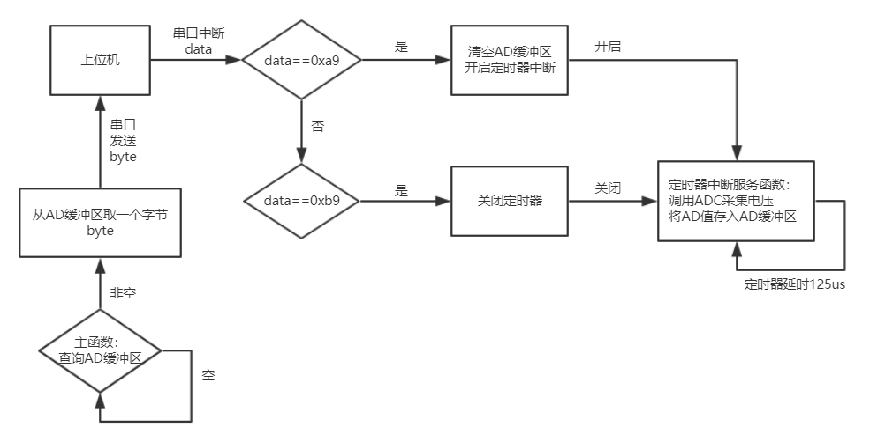

# keil project  

# 硬件资源
模数转换单元ADC1 通道6  
通用定时器 TIMER4  
串口 USART1  
板载 LED  
系统定时器 SysTick

# 程序框图
  

# USART
语音信号所需的采样频率为8KHz，每个样本用一个字节表示，也就是每秒产生64Kb数据
因为单片机片内存储空间太小，不适合用来存储采样数据，最好每采集到一个样本就将其发送到
PC机进行处理. 这样串口通信数率就要大于采样速率，所以选用115200bps的波特率进行通信. 

# ADC
## 模数转换
stm32f103最快可以14个ADC时钟周期采集一次数据，ADC时钟由系统APB2总线时钟分频得到.
APB2总线时钟为72MHz，6分频得到ADC时钟为12MHz(ADC时钟最高不超过14MHz)，
所以最高采样频率约0.85MHz.  
为了提高采样精度，我将其配置为241个ADC时钟周期采集一次，这样最高采样频率约49KHz，
仍远高于所需的采样频率8KHz.

## AD缓冲区
定义一个100字节大小的环形队列作为缓冲区，
带有入队、出队、判断队列空、判断队列满和清空队列操作.
因为串口通信的速率大于采样速率，所以单片机不用存储太多数据，缓冲区规模也不需要太大.

# TIMER
为了保证采样频率固定，使用定时器进行操作，配置定时器4每隔125us产生一次中断，
在中断服务函数中进行AD采集，将采集到的数据放入AD缓冲区，这样就可以控制采样率保持
8KHz.

# main()
在主函数中用一个死循环判断AD缓冲区是否为空，若不为空则取出一个字节通过串口发送给
上位机.