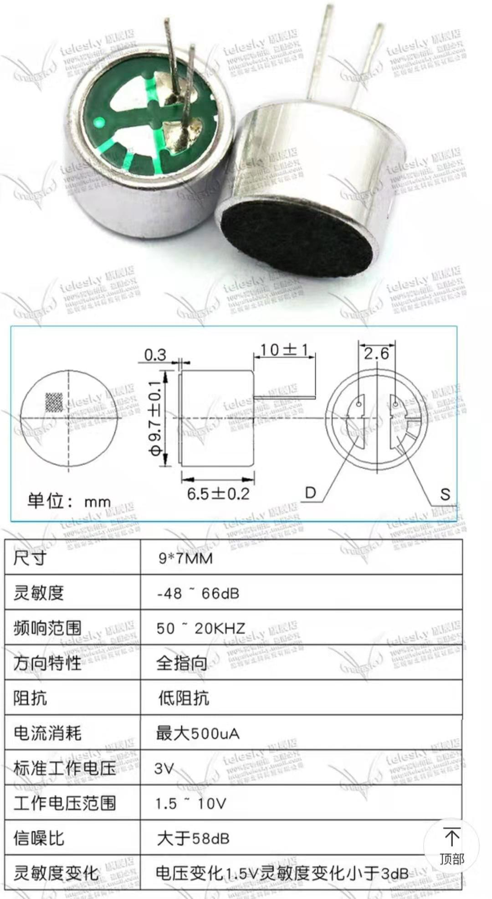
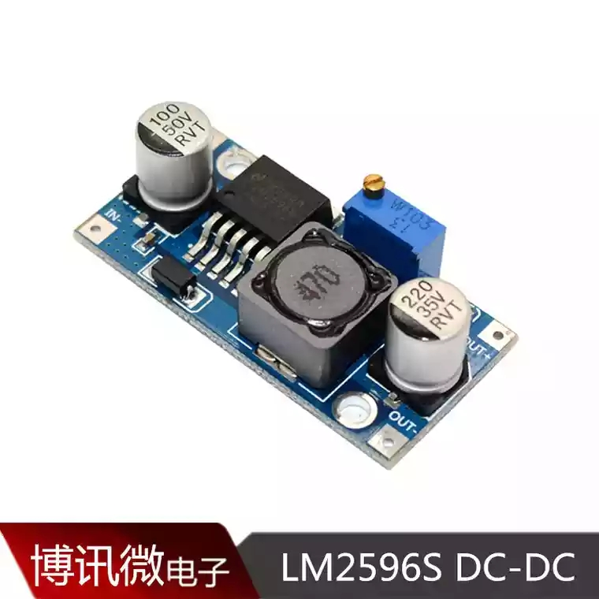
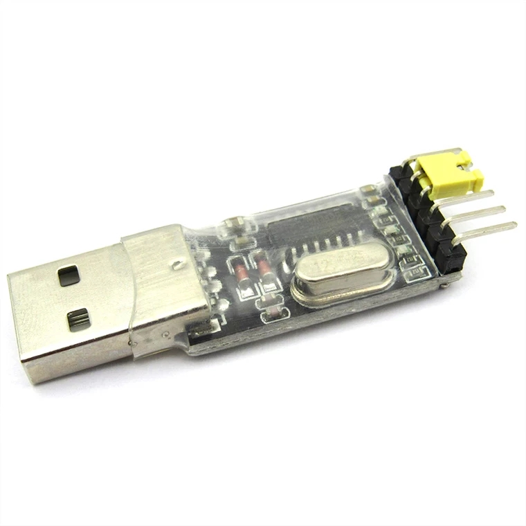

# Sound Collector	`声音采集器`
本项目为复旦大学2016级电子工程系《电子系统设计》课程项目，
要求设计一个声音采集系统，实现音频的采集、放大、滤波、AD转换，
并上传到PC端进行播放

# Bill of Material

|元件|功能|主要参数|参考价格|图片|
|---|---|---|---|---|
|咪头|将音频信号转换为电信号|52dB拾音器带引脚9*7mm|&yen;1.85/5个||
|集成运放|||\*||
|电阻||0603封装|\*||
|电容||0805封装|\*||
|锂电池|为整个系统供电|12V、3000mAh|&yen;47||
|降压模块|为单片机等提供合适的供电电压|`LM2596`, 输出1.25~35V|&yen;2.9||
|单片机|数据处理和传输|`stm32`f103c8t6|&yen;10||
|`CH340`模块|USB转TTL, 程序下载，单片机和上位机通信|55mm\*16mm|&yen;5||
|PCB板|电子元器件电气连接的载体|\*|&yen;50/10块|\*|

# Pin Assignment

|用途      |管脚          |管脚        |用途        |
|:--------|:-------------|:-----------|:----------|
|         |B12           |G           |           |
|         |B13           |G           |           |
|         |B14           |3V3         |           |
|         |B15           |R           |           |
|         |A8            |B11         |           |
|CH340(RX)|A9(USART1_TX) |B10         |           |
|CH340(TX)|A10(USART1_RX)|B1          |           |
|         |A11           |B0          |           |
|         |A12           |A7          |           |
|         |A15           |A6(ADC1_IN6)|模拟音频信号|
|         |B3            |A5          |           |
|         |B4            |A4          |           |
|         |B5            |A3          |           |
|OLED(SCL)|B6(SCL)       |A2          |           |
|OLED(SDA)|B7(SDA)       |A1          |           |
|         |B8            |A0          |           |
|         |B9            |C15         |           |
|         |5V	         |C14         |           |
|         |G	         |C13         |led        |
|         |3V3           |VB          |           |

# 系统框图

# 上位机
调用`pySerial`库，接收串口数据，合成\*.wav文件，使用`pyAudio`进行播放

# Develop Log
2019/3/1:
- [x] 初步确定项目框架
- [x] 确定部分器件型号
- [x] 实现stm32上的AD转换

# 友情链接
[PCB板打样工厂-捷多邦](https://www.jdbpcb.com/)  
[在线流程图制作-ProcessOn](https://www.processon.com/)  
[pySerial’s documentation](https://pythonhosted.org/pyserial/)  
[PyAudio](http://people.csail.mit.edu/hubert/pyaudio/)  
