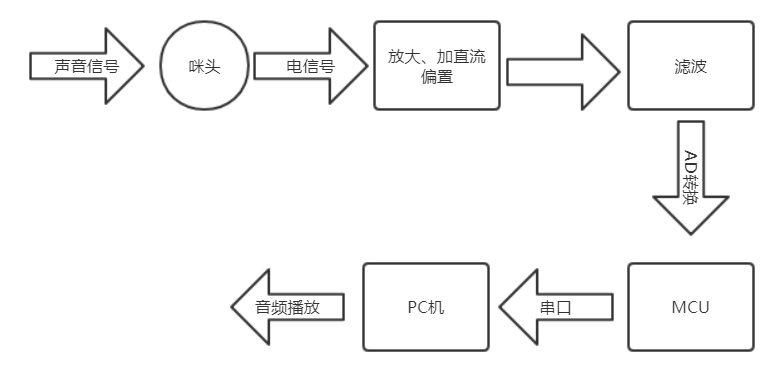
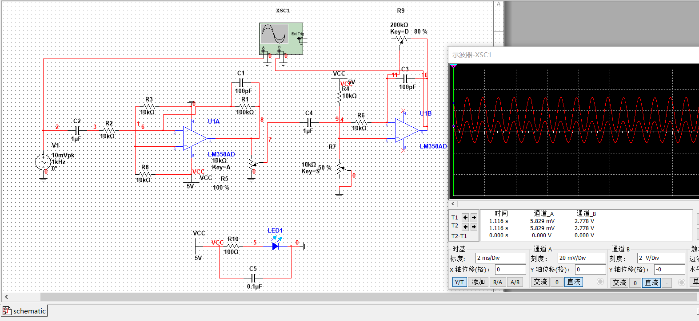
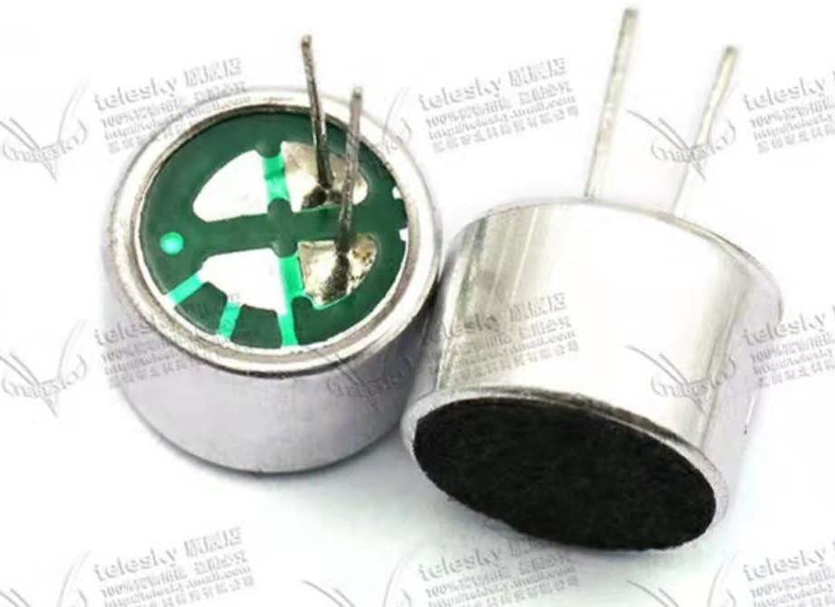
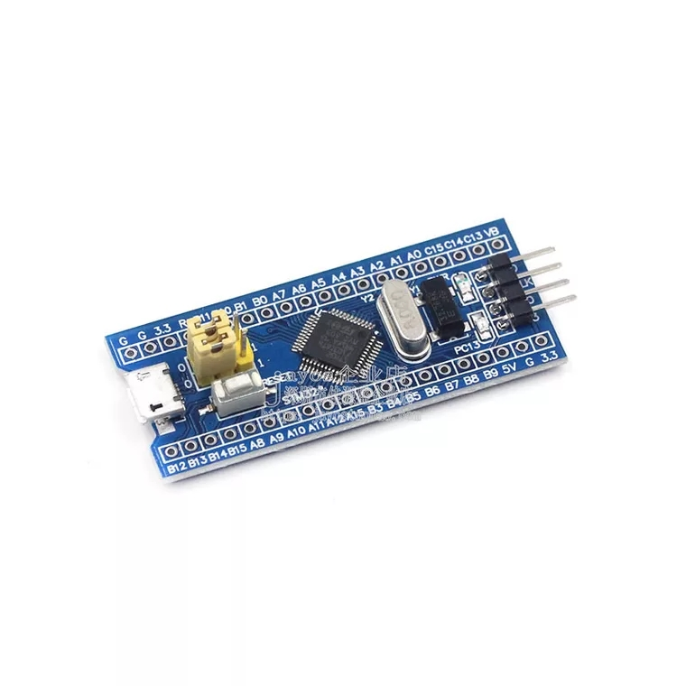
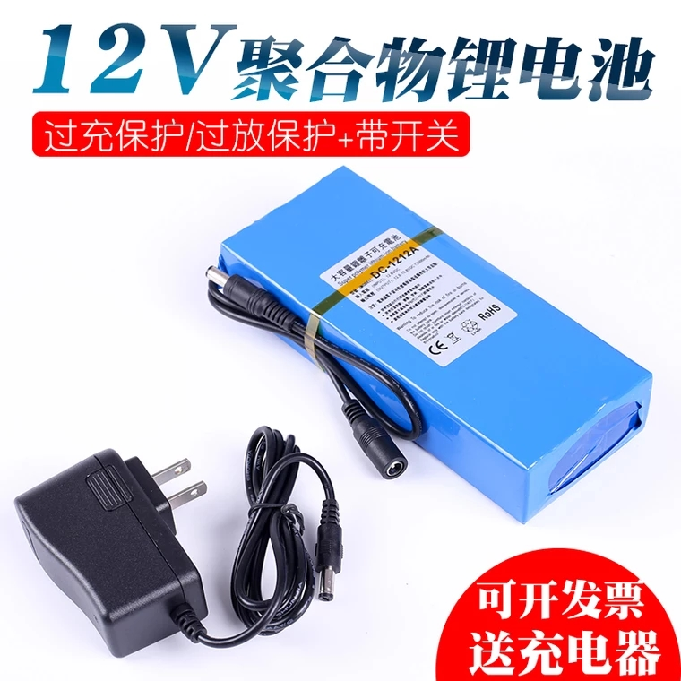

# Sound Collector	`声音采集器`
本项目为复旦大学2016级电子工程系《电子系统设计》课程项目，
要求设计一个声音采集系统，实现音频的采集、放大、滤波、AD转换，
并上传到PC端进行播放

# 系统框图

# 语音信号
## 语音频率
在电话技术中，可用的语音频带范围约为300Hz至3400Hz。因此，
300至3000Hz之间的电磁波谱特低频频带也被称为语音频率，
其表示基带处的声能的电磁能量。为单个语音频率传输信道分配
的带宽通常为4kHz，这包括保护频带，以允许8kHz的采样率作为
数字公共交换电话网（PSTN）所用的脉冲编码调变系统的基础。
根据奈奎斯特-香农采样定理，采样频率（8kHz）必须至少是在
离散时间（4kHz）采样之前进行适当滤波的语音频率最高部分的
两倍，从而有效重建语音信号。
(本段文字摘自[维基百科-语音频率](https://zh.wikipedia.org/wiki/%E8%AF%AD%E9%9F%B3%E9%A2%91%E7%8E%87))  
## 语音强度
一般正常交流说话的声音在40dB ~ 60dB左右,但本项目主要关注的
是咪头所能输出的电信号大小, 经测量,
由咪头直接输出的电压幅值大概在10mV ~ 80mV左右.  

# 咪头
咪头是将声音信号转换为电信号的设备, 这里选用`电容式驻极体咪头`.
驻极体话筒具有体积小、结构简单、电声性能好、价格低的特点,
广泛用于盒式录音机、无线话筒及声控等电路中. 属于最常用的电容话筒.
由于输入和输出阻抗很高, 所以要在这种话筒外壳内设置一个场效应管作为
阻抗转换器, 为此驻极体电容式话筒在工作时需要直流工作电压.  
更多[参考资料](./Reference/咪头)  

# 小信号放大
这里选用两级`LM358`对小信号进行放大, 并通过电位计调节增益,
[Multisim 仿真](./MultisimProject/1KHz电压放大.png)时, 该电路将幅度10mV,
频率1KHz的正弦交流电放大到了幅度为1V, 直流偏置为2.47V的正弦波.
实际使用时, 要考虑咪头输出电压大小, 调节电位计R5.  
且可以调节R7以调整直流偏置大小, 调节R9来微调放大倍数, 将输出电压控制在
0~3.3V之间.  
  
可能需要在AD采样时加入保护电路, 防止声音过大时烧坏MCU.  
更多[参考资料](./Reference/SignalAmplifier/readme.md)  

# 滤波
语音信号频率在300~3400Hz之间, 考虑到保护频带, 设计滤波器时应该
将截止频率控制在4KHz, 至于300Hz以下的频谱则不用滤除, 因为采样时
需要信号有一定的直流偏置, 这个直流偏置就是300Hz以下的频谱成分.  
实验中选用简单二阶有源低通滤波器(参考《模拟电子技术基础(第五版)》童诗白, 华成英等. 图6.3.7)  
或者参考[二阶有源低通滤波器_最简单的二阶低通滤波器电路图 图13.06, 图13.07](http://www.elecfans.com/dianlutu/filter/20170724534697.html)  
需要注意的是, 虽然经过放大, 加直流偏置, 滤波之后整个系统呈现带通特性,
但这并不表明输出的电压没有24Hz以下的频率成分, 系统的带通特性表明输入端
的低频成分无法传递到输出端, 但在系统内部却为其提供了直流偏置,
所以输出端至少还有0Hz分量.  
[Multisim 仿真](./MultisimProject/二阶低通滤波上截止频率.png)

# AD转换
这里选用`stm32`f103c8t6作为主控芯片, 这款芯片内置2个12位`ADC转换单元`,
主频72MHz, 20kB RAM, 64kB FLASH, 4个16位定时器, 3个USART, 
可以满足本项目的要求.  
实际选用某宝上的一款stm32f103c8t6最小系统板, 已焊接晶振和
复位电路, 并引出管脚, 使用DIP40封装.  

**Pin Assignment**

|用途      |管脚          |管脚        |用途        |
|:--------|:-------------|:-----------|:----------|
|         |B12           |G           |           |
|         |B13           |G           |           |
|         |B14           |3V3         |           |
|         |B15           |R           |           |
|         |A8            |B11         |           |
|CH340(RX)|A9(USART1_TX) |B10         |           |
|CH340(TX)|A10(USART1_RX)|B1          |           |
|         |A11           |B0          |           |
|         |A12           |A7          |           |
|         |A15           |A6(ADC1_IN6)|模拟音频信号|
|         |B3            |A5          |           |
|         |B4            |A4          |           |
|         |B5            |A3          |           |
|         |B6            |A2          |           |
|         |B7            |A1          |           |
|         |B8            |A0          |           |
|         |B9            |C15         |           |
|         |5V	         |C14         |           |
|         |G	         |C13         |led        |
|         |3V3           |VB          |           |

详见[./KeilProject/readme.md](./KeilProject/readme.md)

# 上位机
> 上位机是指可以直接发出操控命令的计算机，一般是PC/host computer/master computer/upper computer,屏幕上显示各种信号变化（液压，水位，温度等）。下位机是直接控制设备获取设备状况的计算机，一般是PLC/单片机single chip microcomputer/slave computer/lower computer之类的。上位机发出的命令首先给下位机，下位机再根据此命令解释成相应时序信号直接控制相应设备。下位机不时读取设备状态数据（一般为模拟量），转换成数字信号反馈给上位机。  

使用python编程，调用`pySerial`库，向单片机发送指令，接收串口数据，
合成\*.wav音频文件，使用`winsound`进行播放  
详见[./Scripts/readme.md](./Scripts/readme.md)  

# Bill of Material

|元件|功能|主要参数|参考价格|图片|
|---|---|---|---|---|
|咪头|将音频信号转换为电信号|52dB拾音器带引脚9*7mm|&yen;1.85/5个||
|集成运放|信号放大, 偏置, 滤波|LM358, SOP8封装|&yen;0.32||
|电阻||0805封装|\*||
|电位计||3296W封装|\*||
|电容||0805封装|\*||
|单片机|数据处理和传输|stm32f103c8t6|&yen;10||
|`CH340`模块|USB转TTL, 程序下载，串口通信|55mm x 16mm|&yen;5||
|PCB板|电子元器件电气连接的载体|10cm x 10cm|&yen;50/10块|\*|
|锂电池|为整个系统供电|12V、3000mAh|&yen;47||
|降压模块|为单片机等提供合适的供电电压|`LM2596`, 输出1.25~35V|&yen;2.9||

# Develop Log

2019/3/1:
- [x] 初步确定项目框架
- [x] 确定部分器件型号
- [x] 实现stm32上的AD转换

2019/3/2:
- [x] 更新README.md文件
- [x] 完成pyAudio播放\*.wav文件的编程
- [ ] 发现pySerial和stm32通信存在问题, 调用serial.Serial.open()之后stm32死机,
arduino不存在这个问题, 但arduino无法正确接收pySerial发送的信息

	后续可以考虑以下三种预案：
	1. 继续解决串口通信问题;
	2. 使用SD卡存储语音信号, 再用读卡器读入;
	3. 使用网络传输, socket编程(?)
	
- [ ] 用户界面可以考虑用python easygui编写(串口通信)或者添加OLED屏幕显示

2019/3/4:
- [ ] 如果PC机和单片机无法实时通信, 可以通过红外遥控给单片机发送指令(使用按键会引入较大的噪声)

2019/3/5:
- [x] 完成小信号放大电路的设计与仿真, 可以通过调节电阻参数将输出信号控制在0~3.3V

2019/3/6:
- [x] 完成抗混叠滤波电路的设计与仿真, 滤波时也可以产生两三倍的增益, 缓解前级放大电路的压力

2019/3/6:
- [x] 之前串口通信出错是因为所用的stm32开发板中将RST, boot管脚连接到了CH340,
PC机通过串口使单片机不断地复位. 这应该是软件配置的问题, 但暂时没能很好地解决.
使用自己开发的串口调试助手时, 可以禁用RST, DTR, 发现能够成功通信, 但是不够稳定,
仍然时不时出错. 解决方案是在设计电路板时在单片机和CH340的这两个管脚之间用跳线帽
连接, 程序下载完成后断开. 或者在电路板上不设计下载电路, 只引出USART1管脚.

2019/3/11:
- [x] pySerial接收stm32发来的字节并解析成列表, 存储成\*.npy格式(./SerialRead.py)
- [x] 用PyQt4开发简单的图形界面, 实现同样的功能(./gui_mini.py)

2019/3/12:
- [x] 完成Altium Designer原理图绘制

2019/3/16:
- [x] 完成Altium Designer PCB板绘制
- [ ] PCB板上要预留调试接口

2019/3/17:
- [x] 检查三极管封装

2019/3/19:
- [x] 完善上位机GUI程序;添加接收文本框和发送文本框(其功能暂未添加)

2019/3/21:
- [x] 实现实时波形图绘制

2019/3/22:
- [x] 整理部分文档资料

2019/3/23:
- [x] 实现音频文件的读写与播放

# 友情链接
[PCB板打样工厂-捷多邦](https://www.jdbpcb.com/)  
[在线长度换算-ConvertLIVE](https://convertlive.com/zh/u/转换/毫米/自/密耳#1)  
[在线流程图制作-ProcessOn](https://www.processon.com/)   
[数据手册-ALLDATASHEET](http://www.alldatasheet.com)  
 