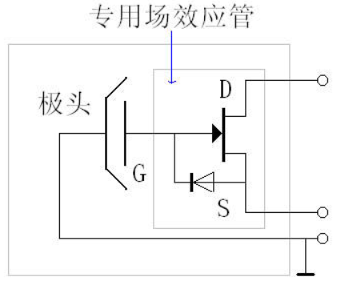
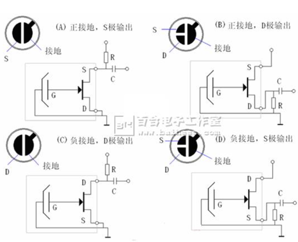

# 咪头

经拆解, 咪头内部有一个N沟道结型场效应管(NJFET) K596, 一个带孔金属薄片
和金属外壳组成的电容,金属薄片连接在场效应管中间管脚G极, 外壳可能接地
(只拆了一个，没看仔细),场效应管上标注K596 B710字样. 网上有的参考图显示
从S极到G极有一个二极管,也有的图中没有, 拆解过程中没有看见, 或者这个
二极管是在场效应管内部的(?).  

# 参考连接电路

  

# 参考资料
[咪头规格书](./EM-B9760UL规格书.pdf)  
[K596datasheet](K596datasheet.pdf)  
[一文看懂咪头的工作原理及结构（驻极体话筒）](http://www.elecfans.com/yuanqijian/dianshengqijian/20180428669686.html)  
