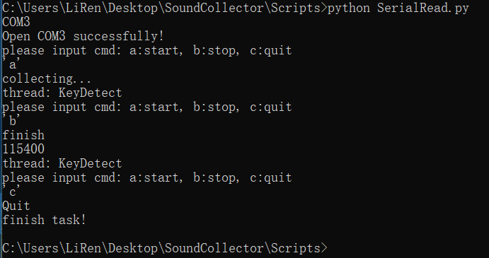
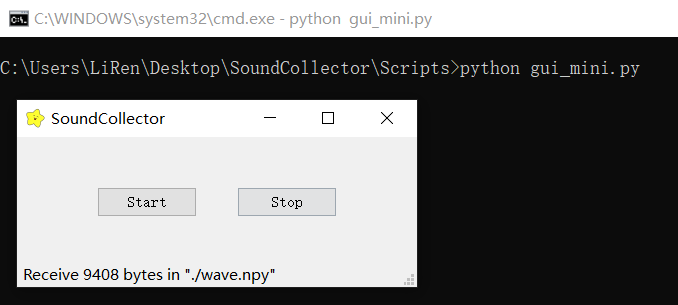
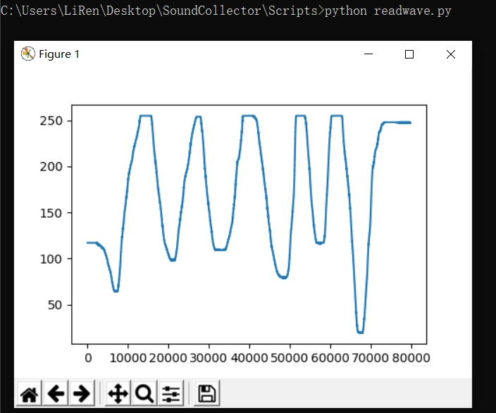
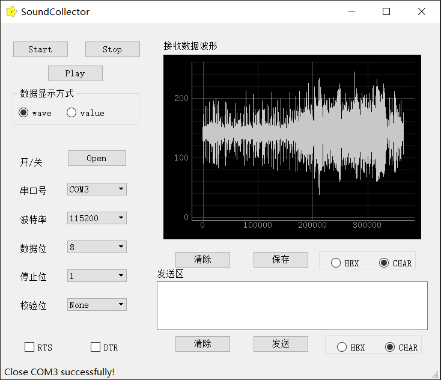

# 上位机

# 业务逻辑
使用pySerial进行串口读写  
上位机发送开始录音命令, 上位机清空接收缓冲区(ser.flushInput()),
下位机接收到开始指令(串口接收中断)之后清空AD缓冲区, 打开中断, 在中断服务函数中进行AD转换,
将采集到的数据放入AD缓冲区中. 在主函数中判断AD缓冲区是否为空, 若不为空则将数据通过串口
发送到上位机.  
上位机发送停止录音命令,下位机接收到指令之后, 关闭AD采集的中断,
主函数中将AD缓冲区内数据全部发送到上位机.
上位机将接收缓冲区内数据全部读出, 存文件, 播放.

# 音频读写播放

## 合成音频文件
**Dependencies:** `python2.x`;`pip`;`NumPy`;`scipy`;`wave`;

[读写WAV格式文件 python stdlib](https://docs.python.org/zh-cn/2.7/library/wave.html)    

```python
#!/usr/bin/env python
#-*- coding: utf-8 -*-
import wave
import numpy as np
import scipy.signal as signal

framerate = 44100
time = 10

# 产生10秒44.1kHz的100Hz - 1kHz的频率扫描波
t = np.arange(0, time, 1.0/framerate)
wave_data = signal.chirp(t, 100, time, 1000, method='linear') * 10000
wave_data = wave_data.astype(np.short)

# 打开WAV文档
f = wave.open(r"chirp.wav", "wb")

# 配置声道数、量化位数和取样频率
f.setnchannels(1)
f.setsampwidth(2)
f.setframerate(framerate)
# 将wav_data转换为二进制数据写入文件
f.writeframes(wave_data.tostring())
f.close()
```

## 播放音频文件
**Dependencies:** `python2.x`;`winsound`; 
> The winsound module provides access to the basic sound-playing machinery provided by Windows platforms. It includes functions and several constants  

[winsound python lib](https://docs.python.org/2/library/winsound.html)  

```python
#!/usr/bin/env python
#-*- coding: utf-8 -*-
import winsound
import time
winsound.PlaySound("chirp.wav", winsound.SND_ASYNC)
time.sleep(10)
```

## 合成音频文件并播放
**Dependencies:** `python2.x`;`winsound`;`NumPy`;

```python
#!/usr/bin/env python
#-*- coding: utf-8 -*-
import wave
import numpy as np

import winsound
import time
import os
wav_file_name = ".tempwav.wav"
framerate = 44100#采样频率
duration = 1#音频时长
#时间参数
t = np.arange(0, duration, 1.0/framerate)
#产生700Hz的单音信号
wave_data = np.sin(2*np.pi*700*t)*5000
wave_data = wave_data.astype(np.short)
# 打开WAV文档
f = wave.open(wav_file_name, "wb")
# 配置声道数、量化位数和取样频率
f.setnchannels(1)
f.setsampwidth(2)#byte
f.setframerate(framerate)
# 将wav_data转换为二进制数据写入文件
f.writeframes(wave_data.tostring())
f.close()

#wav, sr = librosa.load('xx.wav', sr=22050)

#使用winsound.SND_FILENAME标志时程序会被阻塞在这里,直到播放完后函数退出
#如果希望程序继续执行后面的代码，使用winsound.SND_ASYNC进行异步播放. 这条语句会立刻返回，但音频还在播放
winsound.PlaySound(wav_file_name, winsound.SND_FILENAME)
os.remove(wav_file_name)#删除文件
```


# 串口接收
file: SerialRead.py  
**Dependencies:** `python2.x`;`pip`;`NumPy`;`pyserial`;  
**说明**  
调用pySerial控制串口, 由PC机向stm32发送开始采集命令(由命令行读入'a', 串口发送 b'\xa9' ),
单片机开始采集AD值, 放入AD缓冲区后再用串口发送给PC机.  
采集完成之后, 用户在命令行输入字符'b', 串口给stm32发送 b'\xb9' , 单片机接收后停止AD采样,
但AD缓冲区中的数据还会继续发送给PC机. PC机则把接收到的数据存储成\*.npy文件.  
这时如果要重新采集, 可以在命令行输入字符'a', 但是后面采集的数据会把前面的覆盖.  
采集完成之后, 命令行输入字符'c', 退出当前程序.  

	usage:	
	将PC机用USB转ttl模块连接到stm32  
	打开cmd窗口, 进入程序所在路径  
	python SerialRead.py  
	命令行输入 > 'a'  
	...  
	命令行输入 > 'b'
	命令行输入 > 'c'
	AD采样值被存入./wave.npy文件
  

# 小型GUI
file ./gui_mini.py; ./images/littleStar.ico  
**Dependencies:** `python2.x`;`pip`;`NumPy`;`pyserial`;`PyQt4`;  
这部分程序功能和SerialRead.py一样, 只是用按钮替换命令行字符命令:  
Start -- 'a'  
Stop  -- 'b'  

	usage:	
	将PC机用USB转ttl模块连接到stm32  
	打开cmd窗口, 进入的程序所在路径  
	python gui.py  
	点击Start按钮  
	...  
	点击Stop按钮  
	点击 X  
	AD采样值被存入./wave.npy文件
  


使用一个电位计进行模拟, 旋转电位计, 采集到的电压波形如下图:  
  
readwave.py将读取当前目录下的wave.npy文件，调用matplotlib绘制波形图  

# 串口助手GUI
file: ./gui.py; ./images/littleStar.ico

	上面分别用命令行和一个小型的GUI程序实现了串口数据的获取(这两个程序不再进行维护更新)，
	接下来我要开发一个功能更加全面的串口助手，它首先能实现前面两个程序的功能，
	但我希望它同时具有一般的串口助手该有的功能(我以后可能会把它用在其他地方)，
	例如串口号选择，波特率选择，接收和发送文本框等。
	对于本项目还需要实时的波形绘制以及音频播放。
	它可能会过于繁杂，且限于本人水平，暂时可能会不够稳定，但我会一步步完善它，
	并尽量使得代码容易理解。

**Dependencies:** `python2.x`;`pip`;`NumPy`;`matplotlib`;`pyserial`;`PyQt4`; 

**python2.x**  
> Python is a programming language that lets you work more quickly and integrate your systems more effectively.

我使用的python版本是python2.7.15，它和python3会有一些不兼容的地方，
但和python2.x系列应该大部分都能够很好的兼容.  
[python官网](https://www.python.org/)  
[python2.7.15](https://www.python.org/downloads/release/python-2715rc1/)  
[python2.7.15 x86-64 windows下载](https://www.python.org/ftp/python/2.7.15/python-2.7.15rc1.amd64.msi)  
[The Python Tutorial](https://docs.python.org/2.7/tutorial/)  
```cmd
:cmd运行 查看python版本号
> python -V
Python 2.7.15
```

**pip**  
pip是python的一个包管理器，可以用来下载python程序包，例如python-numpy等  
[pip安装](https://pip.pypa.io/en/stable/installing/)  
[pip-Quickstart](https://pip.pypa.io/en/stable/quickstart/)  
[Reference Guide](https://pip.pypa.io/en/stable/reference/)  
```cmd
:cmd运行 查看pip版本号
> pip -V
pip 9.0.3 from d:\xxx\lib\site-packages (python 2.7)
```

**NumPy**  
> NumPy is the fundamental package for scientific computing with Python.

[NumPy官网](http://www.numpy.org/)  
[NumPy下载](https://www.scipy.org/install.html)  
[Quickstart tutorial](https://docs.scipy.org/doc/numpy/user/quickstart.html)  
```cmd
:cmd运行 查看NumPy版本号
> python -c "import numpy;print numpy.version.version"
1.15.4
```


**matplotlib**  
> Matplotlib is a Python 2D plotting library which produces publication quality figures in a variety of hardcopy formats and interactive environments across platforms. 

对于python2需要Matplotlib 2.2.x  
> Matplotlib 3.0 is Python 3 only.  
> For Python 2 support, Matplotlib 2.2.x will be continued as a LTS release and updated with bugfixes until January 1, 2020.

[matplotlib官网](https://matplotlib.org/)  
[Matplotlib 2.2.4 官网](https://matplotlib.org/2.2.4/index.html)  
[Matplotlib 2.2.4下载](https://matplotlib.org/2.2.4/users/installing.html)  
[User's Guide](https://matplotlib.org/2.2.4/users/index.html)  
```cmd
:cmd运行 查看matplotlib版本号
> python -c "import matplotlib;print matplotlib.__version__"
2.2.3
```

**PySerial**  
> This module encapsulates the access for the serial port. 

[pySerial’s documentation](https://pyserial.readthedocs.io/en/latest/)  
[pySerial 安装](https://pyserial.readthedocs.io/en/latest/pyserial.html#installation)  
[pySerial API](https://pyserial.readthedocs.io/en/latest/pyserial_api.html)  
```cmd
:cmd运行 查看pyserial版本号
> python -c "import serial;print serial.__version__"
3.4
```

**PyQt4**  
[PyQt官网](https://riverbankcomputing.com/software/pyqt/intro)  
安装PyQt4  
&emsp;非官方方式:  
&emsp;&emsp;下载安装合适版本的[PyQt4安装包-unofficial win 32/64](https://www.lfd.uci.edu/~gohlke/pythonlibs/#pyqt4)  
&emsp;&emsp;将下载的文件放到合适目录下, cmd进入该目录  
```cmd
> pip install PyQt4-4.11.4-cp27-cp27m-win_amd64.whl
``` 
&emsp;官方方式:  
&emsp;&emsp;[Installing PyQt4](https://www.riverbankcomputing.com/static/Docs/PyQt4/installation.html)

[PyQt4 Class Reference](https://www.riverbankcomputing.com/static/Docs/PyQt4/classes.html)  
[PyQt's Modules](https://www.riverbankcomputing.com/static/Docs/PyQt4/modules.html)  
[PyQt4 - Python Wiki](https://wiki.python.org/moin/PyQt4)  
[PyQt4 tutorial](http://zetcode.com/gui/pyqt4/)  
[PyQt4教程](http://www.qaulau.com/books/PyQt4_Tutorial/)  
[PyQt4入门指南 PDF中文版](https://linux.linuxidc.com/index.php?folder=MjAxMsTq18rBzy821MIvMjTI1S9QeVF0NMjrw8XWuMTPIFBERtbQzsSw5g==)

### Accomplished
- [x] 通过GUI界面设定串口连接的参数(例如，串口号，波特率等)
- [x] 点击串口号下拉列表控件时，刷新串口列表，当系统没有串口时弹框提示
- [x] 有接收文本框，可以显示接收到的串口数据，可以选择以十进制或字符格式显示
- [x] 可以将接收到的串口数据以波形图的形式实时显示

### Bug or Requirement
- [ ] 需要添加发送文本框，可选择将文本框内输入的字符解释为字符串或者十六进制数据
- [ ] 画图和接收文本框同时刷新时会导致程序崩溃
- [ ] 当单片机AD输入口电压为0时接收到空字符，绘图窗口停止更新，AD电压不为0时波形图继续更新.
猜想可能是Qstring和numpy编码格式的问题，numpy将QString中的'\x00'解释成了numpy.array([])
- [ ] 将波形图界面放到应用窗口内部
- [ ] 当前只是实现了串口数据的读取和存储，但未转换成\*.wav音频文件
- [ ] 打包代码，生成\*.exe文件，使其能够在大多数机器上直接运行，而不需要安装众多的依赖库

### example
  
上图是最新版的GUI界面效果展示  
说明：  
1. 在cmd窗口运行gui.py后，显示SoundCollector应用窗口  
2. 波特率，数据位，停止位，校验位都已经默认设置好(用户也可以更改)  
3. 点击串口号下拉列表，程序开始扫描系统串口号并添加到列表中，
用户点击所需要的串口号即可完成设置(界面下方的状态条有相应提示)  
4. 点击Open按钮即可打开串口，这时会弹出波形图绘制窗口，但没有任何数据  
5. 点击Start按钮，上位机发送'\xa9'字节给串口设备(MCU)，单片机随后将采集到的AD数据发送给上位机.
上位机用接收到的串口数据绘制波形图，最多显示最新的100 000个数据点  
6. 点击Stop按钮，上位机发送'\xb9'字节给串口设备(MCU)， 单片机随后停止采集.  
同时上位机将接收到的所有数据以numpy array的格式存文件(./wave.npy)
7. 点击Close按钮，串口关闭，波形图关闭  


# Develop Log
2019/3/2:
- [x] 完成pyAudio播放\*.wav文件的编程(./play.py ./demo.wav)
(\*.wav文件是别的地方复制过来的)

2019/3/11:
- [x] pySerial接收stm32发来的字节并解析成列表, 存储成\*.npy格式(./SerialRead.py)
- [x] 用PyQt4开发简单的图形界面, 实现同样的功能(./gui.py)

2019/3/19:
- [x] 完善GUI界面，可在GUI中修改串口, 波特率等信息 ./gui.py
- [ ] 接收文本框和发送文本框功能尚未实现, 接收到的数据仍然存储在\*.npy文件中

2019/3/21:
- [x] 实现实时波形图绘制

2019/3/21:
- [x] 实现音频文件的读写播放

# 参考资料
[PyQt4 Reference Guide](http://pyqt.sourceforge.net/Docs/PyQt4/)  
[win10下安装PyQt4](https://blog.csdn.net/u013360881/article/details/80304033)   
[python处理音频信号实战 - 知乎](https://zhuanlan.zhihu.com/p/54561504)  
[语音信号的采样和量化](https://blog.csdn.net/godloveyuxu/article/details/77477806)  
[音频处理库—librosa的安装与使用](https://blog.csdn.net/zzc15806/article/details/79603994)  
[使用python写Wave文件](https://blog.csdn.net/qq_39516859/article/details/79834039)  
[winsound- Windows的声音播放模块](https://www.jianshu.com/p/0628abdd38f4)  
[LibROSA 官网](https://librosa.github.io/librosa/)  
[LibROSA core](http://librosa.github.io/librosa/core.html)  
[LibROSA 安装](https://librosa.github.io/librosa/install.html)  
[LibROSA Tutorial](https://librosa.github.io/librosa/tutorial.html)  
[PyAudio 官网](http://people.csail.mit.edu/hubert/pyaudio/)  
[PyAudio Documentation](https://people.csail.mit.edu/hubert/pyaudio/docs/)  
